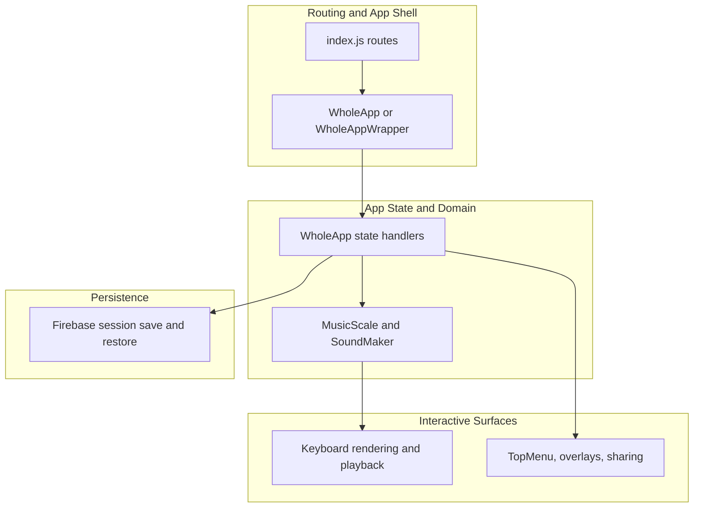

# Project Context

## Module Structure

```text
src/
  components/
  Model/
  data/
  styles/
  __integration__/
  __test__/
e2e/
  accessibility/
docs/
.github/
  copilot/
  hooks/
  skills/
```

## Patterns

| Concern | Approach |
| --- | --- |
| Error handling | UI state is managed centrally in `WholeApp`; some async flows still degrade silently and should be treated carefully during edits |
| State management | `WholeApp` owns app state and passes handlers/props down into menus, keyboard, overlays, and wrappers |
| Data access | Firebase Firestore is used directly from the client for shareable session persistence |
| Testing | Integration-first testing with accessibility coverage and Playwright for end-to-end validation |

## Conventions

- Preserve the integration-first testing split documented in the repo: integration tests first, E2E second, unit tests only for edge cases.
- Treat `src/Model/MusicScale.js` as a protected domain contract: notation arrays and relative solfege behavior must stay backward-compatible.
- Keep accessibility semantics on interactive UI elements, especially keyboard handlers, `aria-label`, and focus return behavior.
- Use Yarn-oriented workflow and commands for this repo; when the shell lacks a global `yarn`, use `corepack yarn`.
- Update the relevant flow doc under `.github/skills/flows/` whenever behavior changes in a documented runtime path.

## Existing Documentation

| Document | Covers |
| --- | --- |
| `README.md` | Project purpose, install/run/build/deploy commands, testing entry points, and dependency notes |
| `docs/TESTING.md` | Integration-first testing policy, accessibility testing layers, coverage requirements, and test distribution validation |
| `CLAUDE.md` | Repo-specific development guidance, accessibility patterns, relative-notation invariants, and recent feature constraints |

## System Flow Overview



## Critical Flows

| Flow | Link |
| --- | --- |
| app-bootstrap | [→](../skills/flows/app-bootstrap.md) |
| scale-change-pipeline | [→](../skills/flows/scale-change-pipeline.md) |
| note-playback | [→](../skills/flows/note-playback.md) |
| session-share | [→](../skills/flows/session-share.md) |
| video-overlay | [→](../skills/flows/video-overlay.md) |
| settings-propagation | [→](../skills/flows/settings-propagation.md) |
