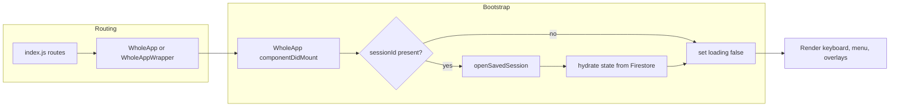

# app-bootstrap

[← Flow Catalog](./SKILL.md)

| Step | File | Function |
| --- | --- | --- |
| Route selection | `src/index.js` | `root.render` |
| Shared route handoff | `src/WholeAppWrapper.js` | `WholeAppWrapper` |
| App mount | `src/WholeApp.js` | `componentDidMount` |
| Session fetch | `src/WholeApp.js` | `openSavedSession` |
| Persistence client | `src/Firebase.js` | `db.collection(...).doc(...).get` |

## Invariants

- `loading` must eventually become `false` for the app to render beyond the loading screen.
- Shared-session hydration must preserve custom scale registration before the main UI renders.
- The `/shared/:sessionId` route is the only session-restore entry path.

## Dependencies

- Firebase Firestore
- settings-propagation
- session-share
