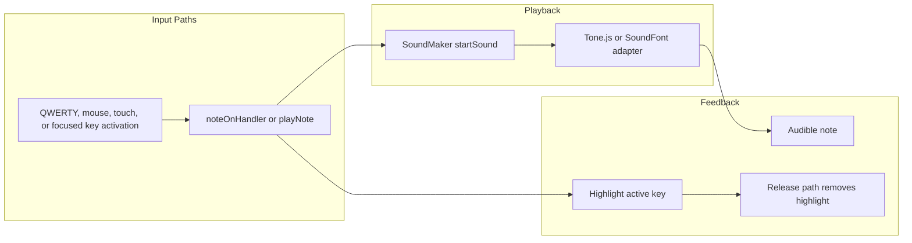

# note-playback

[← Flow Catalog](./SKILL.md)

| Step | File | Function |
| --- | --- | --- |
| Keyboard input handling | `src/components/keyboard/Keyboard.js` | `handleKeyDown` |
| Note activation guard | `src/components/keyboard/Keyboard.js` | `noteOnHandler` |
| Audio facade | `src/Model/SoundMaker.js` | `startSound` |
| Tone adapter | `src/Model/Adapters/Adapter_Tonejs_to_SoundMaker.js` | `keyDown` |
| Focus-key activation | `src/components/keyboard/Key.js` | `handleKeyDown` |

## Invariants

- A note should not be double-triggered while it remains active.
- Audio resume must happen from a user interaction path before playback in browsers that gate AudioContext startup.
- Key highlight and release behavior should stay aligned with note start and stop behavior.

## Dependencies

- scale-change-pipeline
- Accessibility tests under `src/__integration__/accessibility/`
- Audio adapters under `src/Model/Adapters/`
