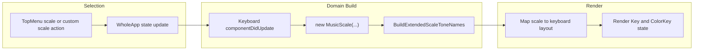

# scale-change-pipeline

[← Flow Catalog](./SKILL.md)

| Step | File | Function |
| --- | --- | --- |
| Scale selection | `src/WholeApp.js` | `handleSelectScale` |
| Custom scale insertion | `src/WholeApp.js` | `handleChangeCustomScale` |
| Keyboard rebuild | `src/components/keyboard/Keyboard.js` | `componentDidUpdate` |
| Domain generation | `src/Model/MusicScale.js` | `init` |
| Relative notation mapping | `src/Model/MusicScale.js` | `makeRelativeScaleSyllables` |

## Invariants

- Relative notation must stay key-independent for the same scale recipe across all roots.
- Changes to one notation mode must not corrupt the others.
- Missing scale recipes should be treated as defects, not normal fallbacks.

## Dependencies

- settings-propagation
- note-playback
- Relative-notation regression and integration tests under `src/__test__/` and `src/__integration__/`
