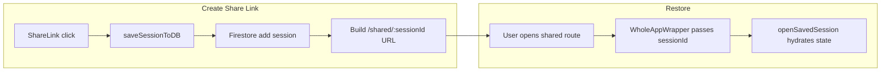

# session-share

[← Flow Catalog](./SKILL.md)

| Step | File | Function |
| --- | --- | --- |
| Share action | `src/components/menu/ShareLink.js` | `onClick` |
| Session save | `src/WholeApp.js` | `saveSessionToDB` |
| Firebase write | `src/Firebase.js` | `db.collection(...).add` |
| Shared route handoff | `src/WholeAppWrapper.js` | `WholeAppWrapper` |
| Session restore | `src/WholeApp.js` | `openSavedSession` |

## Invariants

- Saved and restored state fields must stay in sync when new session-relevant state is introduced.
- Share creation should never silently produce a broken `/shared/undefined` URL.
- Session restore must re-register custom scales before rendering dependent UI.

## Dependencies

- app-bootstrap
- Firebase Firestore
- Share menu components under `src/components/menu/`
