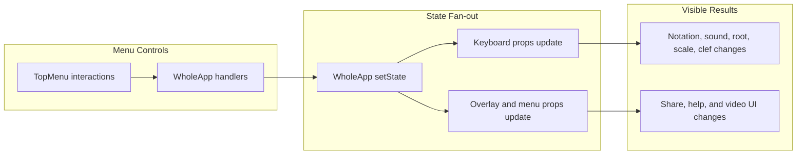

# settings-propagation

[← Flow Catalog](./SKILL.md)

| Step | File | Function |
| --- | --- | --- |
| Menu rendering | `src/components/menu/TopMenu.js` | `TopMenu` |
| Root change | `src/WholeApp.js` | `handleChangeRoot` |
| Notation change | `src/WholeApp.js` | `handleChangeNotation` |
| Notation canonicalization | `src/Model/normalizeNotationOrder.js` | `normalizeNotationOrder` |
| Notation invariant enforcement | `src/WholeApp.js` | `componentDidUpdate` |
| Sound change | `src/WholeApp.js` | `handleChangeSound` |
| Video tab change | `src/WholeApp.js` | `handleChangeActiveVideoTab` |

## Invariants

- Menu interactions should update only the intended slices of app state.
- Keyboard, audio, and overlay behavior should stay synchronized with the active settings.
- Accessibility affordances in menu navigation must remain intact.
- **`state.notation` is always in canonical Notation-menu order** (`["Colors", "Chord extensions", "Scale Steps", "Relative", "Romance", "German", "English"]`). This invariant is enforced at every known writer (`handleChangeNotation`, `openSavedSession`) and guarded by `componentDidUpdate` for any other writer. Enforced since issue #350.

## Dependencies

- scale-change-pipeline
- note-playback
- video-overlay
- Accessibility menu-navigation tests
