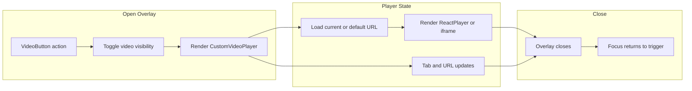

# video-overlay

[← Flow Catalog](./SKILL.md)

| Step | File | Function |
| --- | --- | --- |
| Open or close trigger | `src/components/menu/VideoButton.js` | `handleShow` |
| Visibility toggle | `src/WholeApp.js` | `handleChangeVideoVisibility` |
| URL state update | `src/WholeApp.js` | `handleChangeVideoUrl` |
| Reset URL | `src/WholeApp.js` | `handleResetVideoUrl` |
| Custom player submit | `src/components/menu/CustomVideoPlayer.js` | `handleSubmit` |

## Invariants

- Closing the overlay should return focus to the trigger control.
- Only valid supported URL forms should reach embedded player surfaces.
- Reset should restore the preserved baseline video URL rather than an arbitrary prior value.

## Dependencies

- settings-propagation
- `src/data/config.js`
- Integration tests for the custom video player
